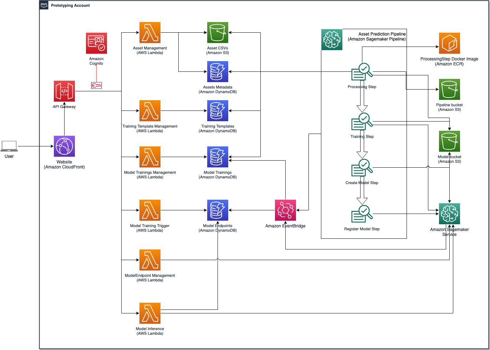

# High-level architecture

The high-level architecture of the project can be divided into 4 main components.

## Data storage

A set of S3 buckets and DynamoDB tables provide a serverless mechanism to store all the necessary data in a secure way while keeping low prices in mind. The customized docker image for the feature engineering step is stored in Amazon ECR repository.

## Web application

The web application is implemented with `react`. It provides a user interface for the user to control the machine learning model training flow and see insights of what is happening without accessing the AWS Console.

The web application bundle is stored in an `S3` bucket, and is exposed to the internet through a `Cloudfront` distribution. The data retrieved to present on the interface is done through `API Gateway` with `Cognito authentication` integrated. The underlying reponse handlers are serverless lambda functions.

## ML Pipeline

The Sagemaker pipeline is responsible to execute and reuse its pre-defined steps. It is interacting with various data storage resources to retrieve or store data.

## Event handlers

The last part of the resources used is event handlers. This mechanism helps visibility of what is happening in the system on an Amazon/AWS service-level.