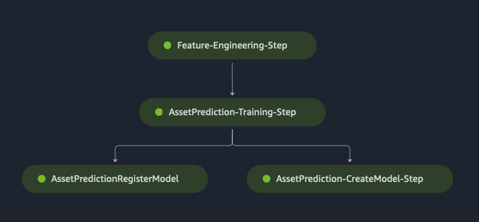

# Model Training Pipeline

For machine learning model training we use Sagemaker Pipelines.

## Pipeline Steps

The next sections will explain each step the pipeline has.

### Processing step

The first step is a processing job which performs the feature engineering part of the whole process.

Due to the complexity of this step and the custom implementation, a `ScriptProcessor` is created as the processor for the `ProcessingStep`. This processor uses a custom docker image, which is hosted in Amazon ECR. The docker image contains the actual application code (see `packages/@infra/ml-pipeline/src/pipeline-definition/docker/step_feature_engineering.py` along with the files in the `lib` folder).

This process is kicked off with an executor code that is fed to the docker container from the pipeline S3 bucket (`packages/@infra/ml-pipeline/src/pipeline-definition/executors/run-fe-step.py`), along with a job argument `executionId` which is the model training instance's Id from the DynamoDB table.

The executor sets up the code environment and runs `step_feature_engineering.py`'s `run_step` function.

There is additional logging in the docker container, that is periodically syncs the step's logs to the model training execution item in DynamoDB.

#### Inputs

The assets' bucket information is passed as a `ProcessingInput` to this step that makes all assets visible for the container.

#### Outputs

Train, test, and features outputs are defined that are synced over the Sagemaker Pipeline's S3 bucket space to the next step.

### Training step

This step is the actual model training step, where we create an `Estimator` and use the `forecasting-deepar` docker image that is out-of-the-box provided by Amazon Sagemaker.

All the hyperparameters are set up from pipeline inputs, so we can completely control the values of these parameters from outside.

The current implementation uses the default training instance (CPU) for the model training. Please refer to [DeepAR documentation](https://docs.aws.amazon.com/sagemaker/latest/dg/deepar.html) and see that you may be able to use GPU instances for training purposes.

#### Inputs

Train and test data inputs are referred from the Processing Step's output.

### Create and register model steps

Once the training step is finished, the model needs to be created and registered with Sagemaker. These steps make sure that this happens.

## Development

As a general approach we recommend to use Sagemaker Notebooks to experiment with the machine learning artifacts and translate them into CDK once the R&D/development work has been finished.

As an example, you can see the an example notebook in `packages/@infra/ml-pipeline/src/pipeline-definition/notebook` that is setting up the pipeline.

This approach is straightforward, however, introduces an unwanted manual step in the automated deployment process. To avoid it, the following steps need to be performed:

1. In the python code, we executed the `print(pipeline.definition())` line, which gives us a JSON representation of the pipeline
1. Replace all "static" content of resource names and ARNs in the template with unique keys
1. Gather all the resources and their respective names/ARNs/etc into a javascript object (`packages/@infra/ml-pipeline/src/MLPipelineInfra/index.ts#L117`)
1. Use a templating engine (e.g. `handlebars.js`) to replace all the keys and upload the generated file to the pipeline S3 bucket with a custom resource (that's how CDK tokens will be extracted and replaced with real values)
1. Once the filled JSON definition is in the S3 bucket, reference to it to create a `sagemaker.CfnPipeline` in CDK

## Events captured from pipeline execution

For events captured from pipeline execution, please refer to the [System events](./events.md) part of the documentation.
